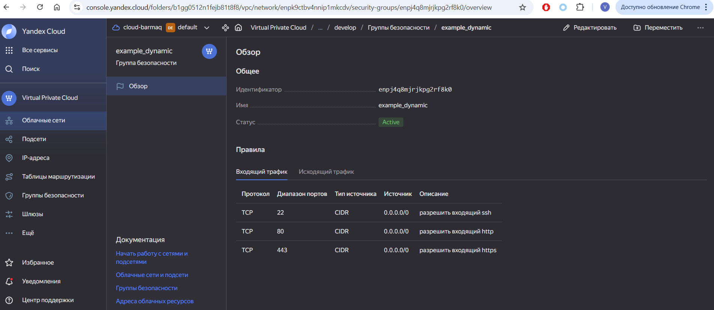

Задание 1  

============================================================ 

Задание 2

параметры для добавления групп безопасности и размера диска посмотреть тут 
https://terraform-provider.yandexcloud.net/DataSources/datasource_compute_instance#example-usage

1)
для машин с именем 1 и 2 ( а не 0  и 1 ) используем конструкцию
  name        = "${var.default_vm.standart.vm_name}-${count.index + 1}"

добавление в группу безопасности :
...
  network_interface {
    security_group_ids = [
    yandex_vpc_security_group.example.id,
  ]
 }
...
2)
попросили создать переменную с данными для ВМ list а с ним for each loop не сработает. переводим в карту.  для себя for vm in var.each_vm: Это конструкция цикла for, которая перебирает каждый элемент в списке var.each_vm. Переменная vm будет представлять текущий объект на каждой итерации.

для создания после вм из пункта 1 используем 
depends_on = [yandex_compute_instance.web]

для размера дисков используем параметр size в 
...
  boot_disk {
    initialize_params {
      ...
      size        = each.value.disk_volume
    }
...

для добавления ключа через file
сначала ( потому что мы не можем использовать конструкцию file("~/.ssh/ycbarmaq.pub") в обьявлении переменной )
locals {
  ssh_key = file("~/.ssh/ycbarmaq.pub")
}

потом вызываем уже его
...
  metadata = {
    serial-port-enable = var.default_vm.standart.serial-port-enable
    ssh-keys           = "ubuntu:${local.ssh_key}"
  }
...

============================================================ 

Задание 3

Создайте 3 одинаковых виртуальных диска размером 1 Гб с помощью ресурса yandex_compute_disk и мета-аргумента count в файле disk_vm.tf .
Создайте в том же файле одиночную(использовать count или for_each запрещено из-за задания №4) ВМ c именем "storage" . Используйте блок dynamic secondary_disk{..} и мета-аргумент for_each для подключения созданных вами дополнительных дисков.

#создаем диски. большинство параметров по умолчанию, включая зону
resource "yandex_compute_disk" "disks" {
  count = 3
  name = "disk-${count.index}"
  type = "network-hdd"
  size = 1
}

в ресурсе
...
#добавляем динамические диски
  dynamic "secondary_disk" {
    for_each = yandex_compute_disk.disks[*]
    content {
      device_name    = secondary_disk.value.name
      disk_id        = secondary_disk.value.id
    }
  }
...

для понимания самому себе - ресурс содержит данные в виде элементов массива. содержимое можно посмотретьв  консоли 
yandex_compute_disk.disks[*]

============================================================ 
  
Задание 4  

для получения данных о виртуалках
в случае с count или простым обьявлением вручную делаем через 

например :
yandex_compute_instance.res_name[*]
yandex_compute_instance.web[*].fqdn
yandex_compute_instance.web[*].network_interface.0.nat_ip_address

в случае с for each перебираем через значения.
 values(yandex_compute_instance.databases)[*].network_interface[0].ip_address

c tftpl не понял - все выводилосьв  одну строку. пришлось добавлять переводы строк. мне кажется так неправильно.

так же с одиночной сторейдж при обьявлении локальной переменной - обязательно надо добавлять имя через интерполяцию

---------------

пересмотрел лекцию внимательнее - удобнее было бы через :

resource "local_file" "hosts_templatefile" {
content = templatefile("${path.module}/hosts.tftpl",

{ webservers = yandex_compute_instance.example })
filename = "${abspath(path.module)}/hosts.ini"
}

и шаблон

[webservers]

%{~ for i in webservers ~}

${i["name"]}   ansible_host=${i["network_interface"][0]["nat_ip_address"]}
%{~ endfor ~}

============================================================ 
  
Задание 5  

по аналогии с локальными переменными для ansible

============================================================ 
  
Задание 6

а вот тут не понял - там вызывается во первых команды линукс для добавления ключа ( у меня терраформ на виндоус ), 
во вторых выполнение команды ansible с указанным плейбуком. но это локальное выполнение и ansible  тем более не установлен.
 так что добавлением этого лога не приведет ни к чему
  

============================================================ 
  
Задание 7

через slice .
например 
{
  "network_id"   = local.vpc.network_id
  "subnet_ids"   = local.vpc.subnet_ids[0:2] ++ local.vpc.subnet_ids[3:]
  "subnet_zones" = local.vpc.subnet_zones[0:2] ++ local.vpc.subnet_zones[3:]
}

============================================================ 
  
Задание 8

[webservers]
%{~ for i in webservers ~}
${i["name"]} ansible_host=${i["network_interface"][0]["nat_ip_address"] platform_id=${i["platform_id "]}}
%{~ endfor ~}

добавить фигурную скобку после адреса : nat_ip_address"]}

============================================================ 
  
Задание 9

используем for и format с условиями
просто список с добавлением 0
[for i in range(1, 100) : format("rc%02d", i)]
исключаем указанные цифры кроме 19
[for i in range(1, 97) : format("rc%02d", i) if !(i % 10 == 0 || i % 10 == 7 || i % 10 == 8 || i % 10 == 9) || i == 19]

